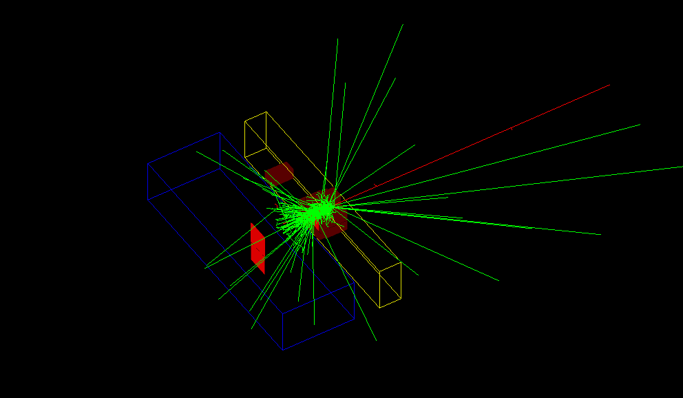
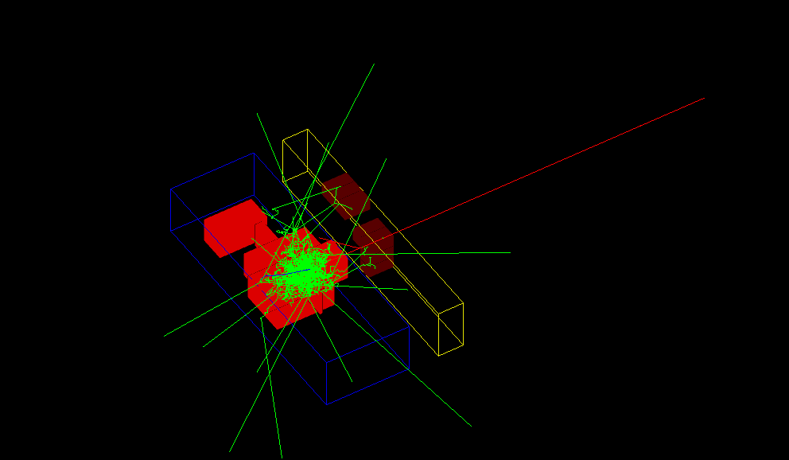
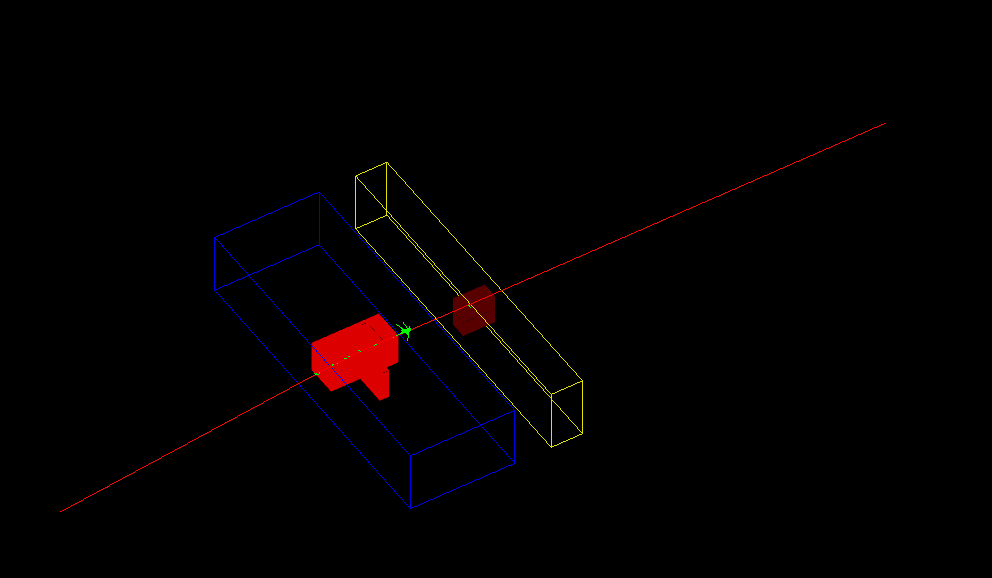
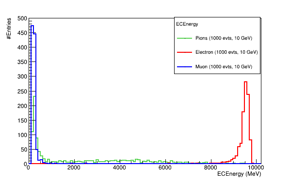
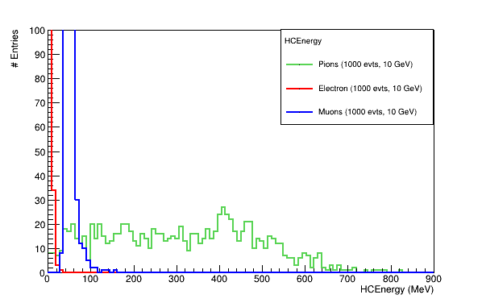

# Calorimeters simulation in the Geant4 framework

## Introduction
This repository contains a simulation code of a simple Calorimeter system with an Electromagnetic Calorimeter (ECAL) and Hadronic (HCAL)Calorimeter in the [Geant4 simulation framework](https://doi.org/10.1016/S0168-9002(03)01368-8)

Simulating this detector system mainly aims to see the shower development and energy deposits for different particles such as electrons, muons, and pions.

The electromagnetic calorimeter is homogeneous and made of CsI. It is placed before the Hadronic calorimeter as the arrangement in some of the famous experiments. A hadronic calorimeter made of lead as the passive absorber and divided into cells. Then plastic scintillators are placed at the centre of these cells.

### Calorimeters response:
ECAL measures the energy deposition for the particles that interact via electromagnetic interaction, such as electrons, positrons and photons. Whereas HCAL measures the energy deposition for the particles that interact via strong interaction, such as protons, neutrons, pions and kaons. Muons are minimum ionizing particles and lose energy only through ionization. So, they will penetrate both the calorimeters and leave no shower. For simplicity, I choose electrons, pions and muons as incident particles. The events images for these particles are shown below.

5 GeV Electron event


5 GeV Pion event


5 GeV Muon event


and the energy distribution in the ECAL and HCAL can be seen in the following histograms for different particles at 10 GeV energy.

ECAL Energy distribution where electrons dominate energy deposition.



HCAL Energy distribution where energy deposition is primarily due to pions.




### Getting started
clone the repository
```bash
git clone https://github.com/Alam-Danish/Calorimeters.git
cd Calorimeters
```
configure the build with CMake
```bash
cd build
cmake ..
make
```
now, to run the simulation
```bash
./calo
```


### Simulation code structure: 

Several different files have been created for the simulation, which is explained in order of requirements:

- **CMakeLists.txt:** It is the core of the simulation. It is used to define the project, link the different headers and files to the Geant4 libraries and finally create an executable.

- **main.cc:** Main file of the simulation. It is used to initialize the Run Manager, Detector Geometry, Physics list and Action required for the simulation. The same file has also been used for the visualization. 


Further, except for these two previously mentioned files, the headers with extension **.hh** have been written to define classes and functions for every source file with extension **.cc**.

- **construction:** First header file is created to initiate classes and functions required to define detector construction. Then the source file contains the definition of detector materials, detector volumes, placement of these materials, and visualisation attributes.

- **PHYSICS List:** We can usually define our own required physics list, but here I used the FTFP_BERT class, which contains all the necessary physics lists, including needed hadronic physics. It has been directly included in **main.cc** file.

- **generator:** It is used to create a particle gun and generate different particles of our choice.

- **action:** It is used for the action initialization and introduces particle generator, run and event actions in the simulation.

- **emcalhit:** It is defined to retrieve the hit (energy deposition in a particular place of the detector at a particular time) details for the EM Calorimeter.
- **emcalSD:** The sensitive detector for the EM Calorimeter. It uses the hit details from **emcalhit**.

- **hadcalhit:** Similar to **emcalhit**, I defined this to get the hit details from the Hadronic Calorimeter.
- **hadcalSD:** Sensitive detector for Hadronic Calorimeter uses the hit details from **hadcalhit**.

- **run:** In tis file, run object is created from **G4Run** class and implemented to get the total energy deposit in the both calorimeters and shower shape at the end of each run. However, we can also define the run in **G4USerRunAction** class but due to flexibility and easyness, this way is preferred.
- **runaction:** It is defined implementat the RunAction class. It used the previous information from **run** to show the anlysis of the simulation and also store the information as ntuples.

- **eventaction:** Class definitions in this file provide interfaces to interact with Geant4 at the beginning and at the end of each event in a run.
